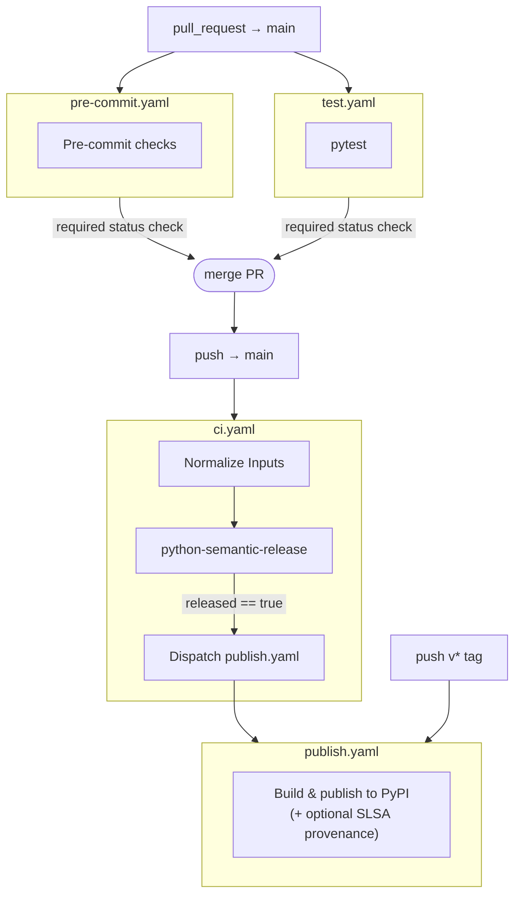

# Python Project Template

A minimal starting point for a Python project wired up to the shared CI/CD workflows. Versioning is driven entirely by
git tags — no version number is stored in any source file. On every push to `main`, python-semantic-release analyses
commits, cuts a release if warranted, and dispatches a build and publish run automatically.

## Project structure

```none
.
├── src/
│   └── sample_app/
│       ├── __init__.py
│       └── cli.py              # entry point: `sample-app`
├── .github/
│   └── workflows/
│       ├── ci.yaml             # main orchestration workflow (release + publish dispatch)
│       ├── pre-commit.yaml     # runs pre-commit checks on every push
│       ├── test.yaml           # runs tests on PRs to main
│       └── publish.yaml        # builds and publishes releases
├── tests/
│   └── cli_test.py
├── pyproject.toml              # Python project config
└── requirements-dev.txt        # Dev dependencies (linting, formatting, pre-commit)
```

## Configuration

### `pyproject.toml`

Edit the `[project]` section to set your package name, description, Python version constraint, and dependencies.
The `version` field is left as `dynamic` — *setuptools-scm* reads it from *git* tags at build time.

### `releaserc.toml` (optional)

> [!NOTE]
> **This is not required.** If you omit the file, PSR runs with its built-in defaults, which are reasonable for most projects.

`releaserc.toml` configures python-semantic-release (**PSR**): commit message format, changelog settings, branch patterns,
and pre-release tokens.

To use it, commit the file to your repo root and add `config-file: releaserc.toml` under the `with:` key of the `release`
job in `ci.yaml`:

```yaml
  release:
    name: Release
    needs: [configure]
    uses: {owner}/python-reusable-workflows/.github/workflows/release.yaml@main
    permissions:
      contents: write # push commits/tags, create GitHub Releases
    with:
      config-file: releaserc.toml   # remove this line to use PSR defaults
    secrets: inherit
```

You can also point `config-file` at `pyproject.toml` if you prefer to keep PSR settings under `[tool.semantic_release]`
there instead of a separate file.

### Workflows

The template ships four workflows that together form the CI/CD pipeline:

| Workflow          | Calls                                                     | Runs when                                    |
| ----------------- | --------------------------------------------------------- | -------------------------------------------- |
| `pre-commit.yaml` | `pre-commit.yaml` (reusable)                              | Every PR to `main`                           |
| `test.yaml`       | `test.yaml` (reusable)                                    | Every PR to `main`                           |
| `ci.yaml`         | `release.yaml` (reusable), then dispatches `publish.yaml` | Push to `main`                               |
| `publish.yaml`    | `publish.yaml` (reusable)                                 | On `v*` tag push, or dispatched by `ci.yaml` |

`ci.yaml` is the main orchestrator: it triggers on every push to `main`, runs python-semantic-release to cut a release
if warranted, and then dispatches `publish.yaml` to build and publish the new version.



Adjust the `with:` inputs as needed — see the [**Reusable workflow reference**](https://github.com/stairwaytowonderland/python-reusable-workflows/blob/main/README.md#reusable-workflows-reference)
for all available options.

## Local development

Install the dev dependencies (includes `pre-commit`, `black`, `isort`, and `autoflake`):

```bash
pip install -r requirements-dev.txt
```

Then install the git hooks so they run automatically before each commit:

```bash
pre-commit install
```

To run all hooks manually against every file:

```bash
pre-commit run --all-files
```
